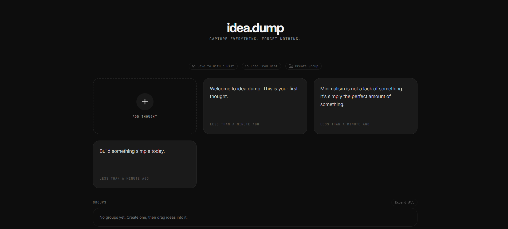

# Idea Dump

A simple app to capture and organize your ideas.

## Live Demo
Check it out here: [Idea Dump](https://idea-dump.netlify.app/)



## Features

- Dump ideas quickly without overthinking
- Group ideas into categories
- Firebase backend for sync and storage
- Clean, minimal interface

## Tech Stack

- React + TypeScript
- Vite
- Tailwind CSS
- Firebase

## Getting Started

Clone the repo:

```bash
git clone https://github.com/DaksshDev/Idea.dump
cd Idea-dump
```

Install dependencies:

```bash
npm install
```

Run the dev server:

```bash
npm run dev
```

## Configuration

Add your Firebase config in `client/src/lib/firebase.ts`:

```typescript
const firebaseConfig = {
  apiKey: "your_api_key",
  authDomain: "your_project.firebaseapp.com",
  projectId: "your_project_id",
};
```

## Contributing

Open to contributions! Just open a PR or issue and I'll review it manually (if i get time).

Keep it simple:
- Fix bugs
- Open issues
- Add features that make sense
- Keep the vibe minimal

---

If you find this useful, give it a star! ⭐